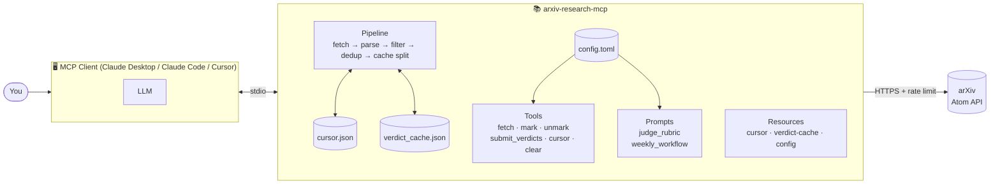

<div align="center">

# 📚 arxiv-research-mcp

**Turn arXiv into a research digest pipeline for any Claude client.**

An MCP server that fetches, filters, and dedups arXiv papers — and ships a skeptical two-axis reviewer prompt your LLM uses to score them. No LLM lock-in. No provider fees. Just a clean pipeline and a battle-tested rubric.

[](https://pypi.org/project/arxiv-research-mcp/)
[](https://www.python.org/downloads/)
[](LICENSE)
[](https://github.com/bksarthak/arxiv-research-mcp/actions/workflows/ci.yml)
[](https://mypy.readthedocs.io/)
[](https://github.com/astral-sh/ruff)

</div>

---

## The problem

Every research-digest tool you've seen does the same thing: fetch the latest papers from a category, dump their abstracts into an LLM, and ask for "a summary." What you get back is an abstract-of-an-abstract, stripped of the details that matter and stuffed with marketing adjectives the original authors wrote.

`arxiv-research-mcp` does the opposite. It treats the LLM as a **skeptical peer reviewer**, not a summarizer. The judge prompt penalizes over-claiming, rewards concrete methods and honest evaluation signals, and asks the model to say *"theoretical — no direct build angle"* when a paper genuinely doesn't support one. The rubric is configurable via a TOML file so it scores against **your** focus, not a one-size-fits-all taxonomy.

The server itself never runs an LLM. It exposes the pipeline as MCP tools/prompts/resources and delegates judging to whatever model your MCP client is already running. Install it into Claude Desktop once, and every future "what did arXiv ship this week on X?" just works.

## What it looks like in use

After you wire it into Claude Desktop and ask *"Build me a research digest of the top AI × security papers from the last 7 days"*:

```text
Claude  ▸ Calling fetch_candidate_papers(window_days=7)
        ▸ 42 candidates after keyword prefilter.
        ▸ Invoking research_judge_rubric on the batch...
        ▸ 4 papers cleared relevance ≥ 7 AND quality ≥ 7.

──────────────────────────────────────────────────────────────
📄 Indirect Prompt Injection Against Tool-Using LLM Agents
   Jane Researcher et al. • cs.CR • arxiv:2604.01234
   https://arxiv.org/abs/2604.01234
   Relevance: 9/10  •  Quality: 8/10

   📝 Demonstrates a concrete indirect-injection vector through tool
      outputs, with 80%+ success across three production agent
      frameworks. Includes a mitigation that reduces success to 4%.

   🔧 Project angle: Reproduce the injection payload against a sandboxed
      LangChain agent that calls a web-search tool.

   🧠 Judge reasoning: Method is concrete and the eval includes baselines
      + an ablation on the mitigation. High on both axes.
──────────────────────────────────────────────────────────────

[... 3 more papers, one dropped as "theoretical — no direct build angle" ...]

Claude  ▸ Marked 4 papers as surfaced. Cursor now tracks 12 arXiv IDs.
```

The cursor means Claude won't re-surface those four papers next week. The rubric means you get actual signal instead of abstract-mulch. The TOML config means you can point the whole thing at `astro-ph.GA` for galaxies or `stat.ML` for ML papers and it works exactly the same.

## Features

- 🧠 **Skeptical reviewer rubric** — a prompt that discounts marketing superlatives and rewards concrete methods, explicit evaluation signals, and honest scope claims. Not another "summarize this abstract."
- 🎯 **Configurable topic focus** — your `rubric_focus` string is injected verbatim into the judge prompt. Point it at any arXiv category with any keyword vocabulary.
- 🔁 **Persistent dedup** — JSON cursor survives restarts. Never re-surface a paper you've already read.
- ⚡ **Verdict caching** — LLM judge scores are cached server-side. Repeat runs within the TTL window skip re-judging known papers and only send net-new candidates to the LLM. Cache auto-invalidates when `rubric_focus` changes.
- 🤖 **Zero LLM lock-in** — the server never calls an LLM. Whatever model your MCP client runs is what judges the papers. Works with Claude, GPT, local models.
- 🛡️ **Defense in depth** — strict input validation, `defusedxml` for safe Atom parsing, SSRF-proof URL construction, no shell execution, `mypy --strict`, bandit-style lint rules.
- ⚡ **Tiny dependency surface** — just `mcp` and `defusedxml`. HTTP via stdlib. TOML via stdlib.
- 🐍 **Python 3.11+** — fully typed, `py.typed` marker, first-class editor support.
- 🧪 **192 tests, 100% passing** — pipeline, parser, validators, config loader, MCP tool handlers, verdict cache, rubric rendering.

## Install

```bash
# With uv (recommended)
uv tool install arxiv-research-mcp

# Or run ephemerally without installing
uvx arxiv-research-mcp

# With pipx
pipx install arxiv-research-mcp

# From source
git clone https://github.com/bksarthak/arxiv-research-mcp.git
cd arxiv-research-mcp
pip install -e '.[dev]'
```

## Quickstart (5 minutes)

### 1. Wire it into Claude Desktop

Edit `~/Library/Application Support/Claude/claude_desktop_config.json` (macOS) or `%APPDATA%\Claude\claude_desktop_config.json` (Windows):

```json
{
  "mcpServers": {
    "arxiv-research": {
      "command": "uvx",
      "args": ["arxiv-research-mcp"]
    }
  }
}
```

Restart Claude Desktop. You should see `arxiv-research` in the MCP indicator.

### 2. Or wire it into Claude Code

Add to `.mcp.json` at your repo root or the global MCP config:

```json
{
  "mcpServers": {
    "arxiv-research": {
      "command": "uvx",
      "args": ["arxiv-research-mcp"]
    }
  }
}
```

### 3. Ask for a digest

In a new Claude chat:

> Use the `weekly_digest_workflow` prompt to build me a research digest for the last 7 days.

That's it. Claude will call `fetch_candidate_papers`, apply the `research_judge_rubric`, filter by thresholds, and surface the winners.

## Try it without an MCP client

Don't want to wire into a client first? The `examples/` directory ships four runnable scripts that exercise the pipeline directly:

```bash
# Pure pipeline — one real HTTPS call to arXiv, everything else in-process.
# Shows fetch → filter → cursor → rubric render. No LLM, no API key.
python examples/quickstart.py

# Full loop with Claude — pip install anthropic && ANTHROPIC_API_KEY
python examples/with_claude.py

# Full loop with GPT — pip install openai && OPENAI_API_KEY
python examples/with_openai.py

# Full loop with Gemini — pip install google-genai && GOOGLE_API_KEY
python examples/with_gemini.py
```

`quickstart.py` is the fastest way to understand what the package does without installing anything else. The three provider scripts (`with_claude.py`, `with_openai.py`, `with_gemini.py`) are kept deliberately parallel — diff them to see exactly where SDKs differ — and each one shows how to build your own automation on top (cron digests, Slack bots, CI-driven reports) without going through MCP transport.

### Ready-to-run topic configs

The shipped [`examples/config.toml`](examples/config.toml) is tuned for AI × security. If you care about something else, [`examples/topics/`](examples/topics/) has drop-in alternatives:

| File | Topic |
|---|---|
| [`topics/machine-learning.toml`](examples/topics/machine-learning.toml) | General ML — scaling, generalization, training dynamics, new methods |
| [`topics/cryptography.toml`](examples/topics/cryptography.toml) | Pure crypto — post-quantum, zero-knowledge, MPC, FHE |
| [`topics/quantitative-biology.toml`](examples/topics/quantitative-biology.toml) | ML × biology — protein structure, drug discovery, single-cell |
| [`topics/distributed-systems.toml`](examples/topics/distributed-systems.toml) | Systems research — consensus, databases, OS internals, network stacks |

Copy whichever matches your interest to `~/.config/arxiv-research-mcp/config.toml` (Linux) or the platform-equivalent path, or point `$ARXIV_RESEARCH_MCP_CONFIG` at the file directly.

### Example user prompts

[`examples/PROMPTS.md`](examples/PROMPTS.md) is a cheat sheet of natural-language prompts you can paste into Claude Desktop (or any MCP client) to drive the server. Organized by topic, covering general patterns, per-topic hunts, and debugging/tuning workflows.

## How it works



The MCP client makes tool calls over stdio. The server does the arXiv fetching, cursor management, and verdict caching. When the client's LLM needs to score papers, it fetches the `research_judge_rubric` prompt (which already has the operator's focus baked in from the config), feeds it the papers, and parses the JSON verdicts back. On repeat runs within the cache TTL, previously-judged papers are returned from the verdict cache — only net-new papers go through the LLM. The server never talks to an LLM; the client never talks to arXiv directly.

## Configure

The server loads its config from the first location that exists:

1. `$ARXIV_RESEARCH_MCP_CONFIG` (explicit override)
2. `$XDG_CONFIG_HOME/arxiv-research-mcp/config.toml` (Linux)
3. `~/Library/Application Support/arxiv-research-mcp/config.toml` (macOS)
4. `%APPDATA%\arxiv-research-mcp\config.toml` (Windows)

If none exist, the server boots with the defaults baked into the package. A minimal working config:

```toml
[topic]
name = "ai-security"
categories = ["cs.CR"]
keywords = [
    "llm", "prompt injection", "jailbreak", "adversarial",
    "poisoning", "backdoor", "red team", "watermark",
]
rubric_focus = """
I care about LLM and agentic AI security: prompt injection, jailbreaks,
tool-use attacks, adversarial ML, and applied attacks with novel
methodology. Less interested in pure crypto theory or surveys.
"""
```

See [`examples/config.toml`](examples/config.toml) for a fully-documented reference with every knob explained. The `rubric_focus` field is the one that matters most — it's injected verbatim into the judge prompt, so write it like you'd brief a reviewer.

## MCP surface

### Tools

| Tool | Purpose |
|---|---|
| `fetch_candidate_papers(window_days, categories?, keywords?, dedup?, use_cache?)` | Fetch + parse + window-filter + keyword-prefilter. Returns `candidates` (net-new) and `cached_verdicts` (previously judged). Deduplicates against the cursor by default. Set `use_cache=False` to bypass the verdict cache and re-judge everything. |
| `mark_papers_surfaced(arxiv_ids)` | Add IDs to the dedup cursor. Call this after your LLM has scored and surfaced a batch. |
| `unmark_papers(arxiv_ids)` | Remove IDs from the cursor. Useful when tuning the rubric. |
| `get_cursor_state(limit)` | Inspect the cursor without clearing it. |
| `clear_cursor(confirm)` | Wipe the cursor. Requires `confirm=True`. |
| `submit_verdicts(verdicts_json)` | Cache LLM judge verdicts (both surfaced and rejected). Call after judging so repeat runs skip re-judging known papers. |
| `get_cached_verdicts(limit)` | Inspect the verdict cache contents and rubric hash. |
| `clear_verdict_cache(confirm)` | Wipe the verdict cache. Requires `confirm=True`. Use when retuning the rubric. |

### Prompts

| Prompt | Purpose |
|---|---|
| `research_judge_rubric(papers_json)` | The skeptical two-axis reviewer template with your `rubric_focus` filled in. Optionally embeds a batch of papers. |
| `weekly_digest_workflow(window_days, max_surfaced, cadence)` | Higher-level orchestration template: fetch → judge → rank → surface → mark. |

### Resources

| URI | Purpose |
|---|---|
| `cursor://state` | Current dedup cursor as JSON. |
| `verdict-cache://state` | Current verdict cache: rubric hash, total entries, all cached verdicts. |
| `config://active` | Currently-active configuration (topic + limits + config path). No secrets — there are none to redact. |

## FAQ

<details>
<summary><b>Does this run an LLM itself?</b></summary>

No. The server exposes tools, prompts, and resources over MCP. The connected client — Claude Desktop, Claude Code, or any other MCP client — runs its own LLM and applies the judge rubric. The server's cost is zero beyond your regular client bill.
</details>

<details>
<summary><b>Which MCP clients does it work with?</b></summary>

Any client that speaks the Model Context Protocol over stdio. Tested with Claude Desktop and Claude Code. Cursor, Continue, and other MCP-capable editors should work with equivalent config blocks.
</details>

<details>
<summary><b>Can I use it for non-security topics?</b></summary>

Yes. The topic is entirely driven by config. Swap the `categories` and `keywords` arrays and rewrite `rubric_focus`, and the same pipeline works for `stat.ML` (machine learning), `astro-ph.GA` (galactic astronomy), `q-bio.QM` (quantitative biology), or any other arXiv category.
</details>

<details>
<summary><b>Does it cost money to run?</b></summary>

The package itself is free and so is the arXiv API. The only cost is whatever your MCP client charges for LLM inference when it applies the judge rubric — which would be a handful of messages per digest.
</details>

<details>
<summary><b>How do I schedule a weekly digest?</b></summary>

Clients handle scheduling. The simplest path is to put `examples/with_claude.py` behind a cron job — it doesn't need an MCP client to run, just an Anthropic API key. The full script is ~200 lines and demonstrates the complete loop.
</details>

<details>
<summary><b>What happens if arXiv is down?</b></summary>

Graceful degradation. `fetch_candidate_papers` returns whatever was collected before the failure (possibly an empty list), logs the error, and the tool response carries `ok: true` with an empty candidates array. The client gets a short list and can retry.
</details>

<details>
<summary><b>How do I add more sources (Semantic Scholar, IACR ePrint)?</b></summary>

Not in v1 — planned for v2. The architecture is deliberately pluggable; the `pipeline.py` orchestrator takes a list of fetchers in theory, we just ship one right now. Open an issue if you'd like to see a specific source prioritized.
</details>

<details>
<summary><b>Where does the cursor and verdict cache live?</b></summary>

Under your platform's data directory:
- Linux: `$XDG_DATA_HOME/arxiv-research-mcp/` (typically `~/.local/share/arxiv-research-mcp/`)
- macOS: `~/Library/Application Support/arxiv-research-mcp/`
- Windows: `%LOCALAPPDATA%\arxiv-research-mcp\`

Two files: `cursor.json` (dedup state) and `verdict_cache.json` (LLM judge scores). Override the directory with `[server] data_dir = "/absolute/path"` in your config.
</details>

<details>
<summary><b>Can I reset the dedup state?</b></summary>

Yes — call `clear_cursor(confirm=True)` from the MCP client, or just delete the cursor file. The next fetch will re-establish it empty.
</details>

<details>
<summary><b>How does verdict caching work?</b></summary>

When the client submits judge verdicts via `submit_verdicts`, they're stored in `verdict_cache.json`. On the next `fetch_candidate_papers` call, papers with cached verdicts are returned pre-scored in `cached_verdicts` — only net-new papers go to `candidates` for judging. The cache auto-invalidates when you change `rubric_focus` in config, and entries expire after the configured TTL (default 7 days). To bypass the cache for a fresh re-judge, pass `use_cache=False`, or wipe it with `clear_verdict_cache(confirm=True)`.
</details>

## Development

```bash
git clone https://github.com/bksarthak/arxiv-research-mcp.git
cd arxiv-research-mcp
python -m venv .venv
source .venv/bin/activate        # Windows: .venv\Scripts\activate
pip install -e '.[dev]'
pre-commit install

# Lint + format
ruff check .
ruff format --check .

# Type check
mypy src tests

# Test
pytest
```

CI runs all four on every push across Python 3.11, 3.12, and 3.13. See [`.github/workflows/ci.yml`](.github/workflows/ci.yml).

## Security

See [`SECURITY.md`](SECURITY.md) for the full threat model and responsible-disclosure policy. Short version:

- No shell execution anywhere — not even as an option.
- `defusedxml` instead of stdlib `ElementTree` — XXE / billion-laughs protection.
- Only one outbound host is ever contacted: `export.arxiv.org`. URLs are constructed server-side from validated inputs; users cannot inject a hostname.
- Every MCP tool argument passes through a validator in [`src/arxiv_research_mcp/security.py`](src/arxiv_research_mcp/security.py) before any I/O.
- Cursor and verdict cache writes are atomic via `os.replace()` — a crash mid-write leaves the old file intact.
- `mypy --strict` on every source file, including tests.

## Built with Claude Code

**This project — the pipeline, the rubric, the tests, the docs, this README — was designed, written, and type-checked end-to-end in collaboration with [Claude Code](https://claude.com/claude-code)**, Anthropic's CLI for working on codebases with Claude.

Claude Code proposed the architecture, implemented every module, ran `mypy --strict` + `ruff` + `pytest` against its own output on every iteration, fixed what it found, and stopped at the human-judgment handoffs (publishing, secrets, git history, API decisions). The two-axis skeptical rubric, the cursor model, the security posture, the provider-parallel examples, and the multi-topic configs all came out of extended conversations where Claude Code proposed options, called out tradeoffs, and built what we picked.

If you're considering a similar agent-led build, the short recipe is: **give the agent a real quality gate, keep the feedback loop tight, and trust it with the tedious parts while you keep the judgment calls.** The result you're reading is what that looks like.

## Acknowledgments

- [arXiv](https://arxiv.org/) for running the Atom API and making it free to everyone.
- [Anthropic](https://www.anthropic.com/) for the Model Context Protocol, the Python SDK, and [Claude Code](https://claude.com/claude-code) itself.
- [defusedxml](https://github.com/tiran/defusedxml) and [astral-sh/ruff](https://github.com/astral-sh/ruff) for being the right tools in their respective lanes.

## License

MIT — see [`LICENSE`](LICENSE).

---

<div align="center">

**Found it useful?** Star the repo, share it, or tell me what broke on [Issues](https://github.com/bksarthak/arxiv-research-mcp/issues).

</div>
